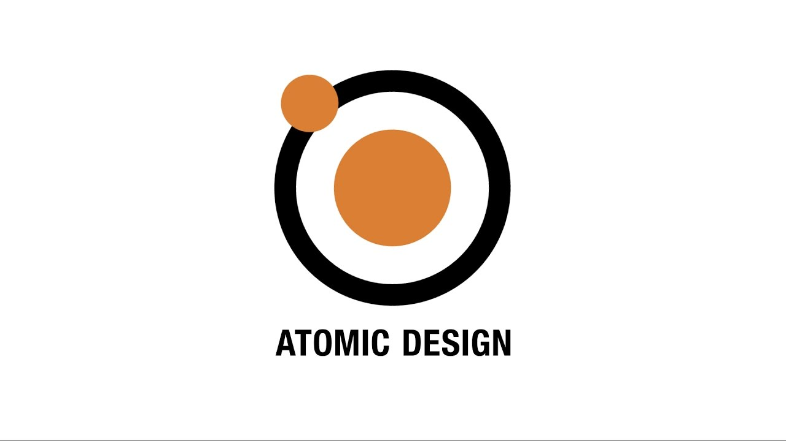

<h1 id="heading" align="center">Papillon Bits</h1>

<div id="logo" align="center">
  
</div>

<div id="badges" align="center">
  <p align="center">
    <a href="https://nodejs.org/">
      
      
    </a>
    <a href="https://www.npmjs.com/org/papillonbits">
      
      
    </a>    
    <a href="https://travis-ci.org/github/papillonbits/papillonbits">
      
      
    </a>
    <a href="https://codecov.io/gh/papillonbits/papillonbits">
      
      <a href="https://github.com/codecov/">
        
      </a>
    </a>
  </p>
  <p align="center">
    <a aria-label="downloads" href="https://npm-stat.com/charts.html?package=@papillonbits/components&from=2018-10-13">
      
    </a>
    <a aria-label="last commit" href="https://github.com/papillonbits/papillonbits/commits/master">
      
    </a>
    <a aria-label="contributors graph" href="https://github.com/papillonbits/papillonbits/graphs/contributors">
      
    </a>
    <a aria-label="license" href="https://github.com/papillonbits/papillonbits/blob/master/LICENSE">
      
    </a>
    <a href="https://github.com/papillonbits/papillonbits/issues">
      
    </a>
    <a href="https://github.com/papillonbits/papillonbits/pulls">
      
    </a>
  </p>
  <p align="center">
    <a href="https://github.com/webpack/">
      
      
    </a>
    <a href="https://github.com/lerna/">
      
      
    </a>
    <a href="https://github.com/babel/">
      
      
    </a>
  </p>
  <p align="center">
    <a href="https://github.com/facebook/jest">
      
      
    </a>
    <a href="https://github.com/storybookjs">
      
      
    </a>
    <a href="https://github.com/puppeteer">
      
      
    </a>
  </p>
  <p align="center">
    <a href="https://github.com/airbnb">
      
      
    </a>
    <a href="https://github.com/eslint">
      
      
    </a>
    <a href="https://github.com/stylelint">
      
      
    </a>
    <a href="https://github.com/prettier">
      
      
    </a>
    <a href="https://github.com/editorconfig/">
      
      
    </a>
  </p>
  <p align="center">
    <a href="https://github.com/facebook/react">
      
      
      
      
    </a>
    <a href="https://github.com/reduxjs">
      
      
      
    </a>
  </p>
  <p align="center">
    <a href="https://github.com/ReactTraining">
      
      
    </a>
    <a href="https://github.com/facebook/react">
      
      
    </a>
    <a href="https://github.com/bradfrost/atomic-design">
      
      
    </a>
  </p>
  <p align="center">
    <a href="https://github.com/necolas/normalize.css">
      
      
    </a>
    <a href="https://github.com/sass">
      
      
    </a>
    <a href="https://github.com/css-modules">
      
      
    </a>
  </p>
  <p align="center">
    <a href="https://github.com/nodejs">
      
    </a>
    <a href="https://github.com/googlechrome">
      
    </a>
    <a href="https://github.com/mozilla">
      
    </a>
    <a href="https://github.com/apple">
      
    </a>
    <a href="https://github.com/MicrosoftEdge">
      
    </a>
    <a href="https://github.com/MicrosoftEdge">
      
    </a>
  </p>
</div>

# Papillon Bits

A comprehensive Lerna monorepo containing reusable React components, CSS primitives, utility libraries, and build configuration tools for modern web development.

## Introduction

Papillon Bits is a monorepo-based design system and component library built with modern JavaScript, React, and CSS. It provides a complete toolkit for building accessible, maintainable, and scalable web applications using component-driven development principles and Flux-based architecture.

## Packages

### [@papillonbits/components](./packages/components)

A comprehensive collection of accessible React components following atomic design principles:

- **Alert** - Notification and alert messages
- **Blankslate** - Empty state placeholders
- **Box** - Layout container component
- **BranchName** - Git branch name display
- **Breadcrumb** - Navigation breadcrumbs
- **Button** - Interactive button components
- **Dropdown** - Dropdown menus and selectors
- **ErrorBoundary** - React error boundary wrapper
- **Form Components**
  - Checkbox - Checkbox input
  - Input - Text input fields
  - Radio - Radio button input
- **Grid**
  - DisplayTable - Tabular data display
  - FlexGrid - Flexible grid layouts
- **Icon** - Icon components
- **Label** - Label and tag components
- **Layout** - Page layout components
- **Loader** - Loading indicators
- **Navigation**
  - Menu - Navigation menus
  - TabNav - Tab navigation
  - UnderlineNav - Underlined navigation
- **Pagination**
  - PreviousNext - Previous/next pagination controls
- **Popover** - Popover and tooltip containers
- **Progress** - Progress indicators
- **SVG** - SVG components and utilities
- **Select** - Select dropdown components
- **SelectMenu** - Advanced select menu
- **Subhead** - Subheading components
- **Toast** - Toast notifications

### [@papillonbits/css](./packages/css)

CSS architecture built on SCSS with comprehensive styling modules:

- **autocomplete** - Autocomplete input styles
- **avatars** - Avatar and profile image styles
- **base** - Base/reset styles
- **box** - Box component styles
- **branch-name** - Git branch styling
- **buttons** - Button styles and variants
- **color-modes** - Dark/light mode support
- **core** - Core CSS primitives
- **forms** - Form element styles
- **header** - Header component styles
- **labels** - Label and tag styles
- **layout** - Layout utilities
- **loaders** - Loading spinner styles
- **markdown** - Markdown content styles
- **marketing** - Marketing page styles
- **navigation** - Navigation component styles
- **pagination** - Pagination styles
- **primitives** - Design primitives and tokens
- **product** - Product-specific styles
- **select-menu** - Select menu styles
- **support** - Support utilities
- **table-object** - Table styling
- **toasts** - Toast notification styles
- **tooltips** - Tooltip styles
- **truncate** - Text truncation utilities
- **utilities** - CSS utility classes

### [@papillonbits/library](./packages/library)

JavaScript utility library with modular helper functions:

- **a11y** - Accessibility utilities
- **array** - Array manipulation functions
- **auth** - Authentication utilities
- **boolean** - Boolean helpers
- **browser** - Browser detection and utilities
- **date** - Date formatting and manipulation
- **event** - Event handling utilities
- **hooks** - Custom React hooks
- **number** - Number formatting and utilities
- **object** - Object manipulation helpers
- **pagination** - Pagination logic
- **sort** - Sorting utilities
- **store** - State management utilities
- **string** - String manipulation functions

### [@papillonbits/setup](./packages/setup)

Build configuration and development tooling:

- **babel** - Babel transpilation configuration
- **eslint** - ESLint linting rules
- **jest** - Jest testing configuration
- **prettier** - Prettier formatting rules
- **storybook** - Storybook configuration
- **stylelint** - Stylelint CSS linting
- **webpack** - Webpack bundling configuration

## Concepts

### Accessibility

All components are built with accessibility in mind, following WCAG guidelines and utilizing tools like `@axe-core/react` and `jest-axe` for automated accessibility testing.

### Application Architecture

The project follows **Flux-based application architecture** using Redux for state management:
- **Redux** - Centralized state container
- **Redux Thunk** - Async action handling
- **Redux Logger** - Development logging
- **React Redux** - React bindings for Redux

### Bootstrap

Get started with the project using these commands:

```bash
# Clean installation
npm run clean-up

# Install all packages
npm run install-packages

# Install latest papillonbits packages
npm run install-papillonbits-latest

# Bootstrap for different environments
npm run bootstrap-test        # Test environment
npm run bootstrap-acceptance  # Acceptance environment
npm run bootstrap-release     # Release environment
```

Each bootstrap command runs: build → storybook build → lint → format → test → coverage report

### Code Style

Consistent code style is enforced through:

- **Code Linting using ESLint** - JavaScript/JSX linting with Airbnb config
  ```bash
  npm run lint              # Lint all code
  npm run lint:js:jsx       # Lint JS/JSX files
  npm run lint:scss         # Lint SCSS files
  ```

- **Code Formatting using Prettier** - Automatic code formatting
  ```bash
  npm run format            # Format all code
  npm run format:js:jsx     # Format JS/JSX files
  npm run format:scss       # Format SCSS files
  ```

- **File Formatting using EditorConfig** - Editor configuration consistency

### Compiling using Webpack / Babel

The project uses Webpack 5 and Babel for modern JavaScript compilation:
- **Babel** - ES6+ to ES5 transpilation with React JSX support
- **Webpack** - Module bundling with code splitting
- Supports ES2015 (ES6) through ES2025 (ES16) features

### Component Design

Components follow the principle of **splitting logic from presentation**:
- Container components handle business logic and state
- Presentational components focus on UI rendering
- Promotes reusability and testability

### Component Driven Development

The project embraces **Component Driven Development** using Storybook:
- Build pages from atoms to pages using atomic design methodology
- Isolated component development and testing
- Visual documentation and testing

```bash
# Start Storybook in develop mode
npm run start-storybook-develop  # Port 3003

# Start Storybook in release mode
npm run start-storybook-release  # Port 5005

# Build static Storybook
npm run build-storybook-develop
npm run build-storybook-release

# Deploy Storybook
npm run deploy-storybook-develop
npm run deploy-storybook-release
```

### Continuous Delivery

Automated package publishing to npm:
```bash
npm run release
```

This command:
1. Collects build folders
2. Publishes packages via Lerna
3. Restores build folder structure

### Continuous Integration

The project includes scripts for CI/CD pipelines:
- Automated testing with coverage reporting
- Build verification across environments
- Code quality checks (linting and formatting)

### Cross Browser Compatibility

Built with cross-browser support using:
- Autoprefixer for CSS vendor prefixes
- Babel polyfills for JavaScript features
- Modern browser targets with graceful degradation

### CSS Architecture

The CSS is organized following SCSS modular architecture:
- **Primitives** - Design tokens and variables
- **Core** - Base styles and resets
- **Utilities** - Utility classes for common patterns
- **Components** - Component-specific styles
- **Layouts** - Page layout styles
- **Color Modes** - Theme support (light/dark modes)

See `packages/css/src` for the complete SCSS structure.

### Language using ECMAScript Features from 2015 (ES6) to 2025 (ES16)

The codebase leverages modern JavaScript features:
- ES6: Arrow functions, classes, modules, destructuring
- ES7: Async/await, object spread
- ES8+: Optional chaining, nullish coalescing, and beyond
- Babel ensures backward compatibility

### Local Development

Development commands per package:

**Root level:**
```bash
npm run start-storybook-develop  # Start development server
npm run test:tdd                 # Test-driven development mode
npm run lint:format              # Lint and format code
```

**Package level:**
```bash
cd packages/[package-name]
npm run build                    # Build package
npm run build-test              # Build for test
npm run build-acceptance        # Build for acceptance
npm run build-release           # Build for release
```

### Microsite

The project includes Storybook-based microsites for documentation:
- Develop microsite - Development version with all components
- Release microsite - Production-ready documentation

### Monorepo using Lerna

Managed as a Lerna monorepo (v9.0.3):
- Independent or fixed versioning (currently fixed at 1.12.0)
- Shared dependencies at root level
- Individual package publishing
- Hoisted node_modules for efficiency

### Rendering using React

Built with React 19.2.3:
- Modern React features (hooks, concurrent features)
- React DOM for web rendering
- Component-based architecture

### Routing using React Router

Navigation handled by React Router 7.11.0:
- Declarative routing
- Dynamic route matching
- History management

### Runtime using Node.js

Requires Node.js 24.12.0 and npm 11.6.2 for development and builds.

### Testing using Jest

Comprehensive testing with Jest 30.2.0:
```bash
npm run test              # Run all tests with coverage
npm run test:tdd          # Watch mode for TDD
npm run test:generate-output  # Generate test output for Storybook
npm run report-coverage   # Upload coverage to Codecov
```

Features:
- React Testing Library integration
- Jest Axe for accessibility testing
- Snapshot testing
- Code coverage reporting

### Version Control using Git

Standard Git workflow with:
- GitHub repository hosting
- Branch-based development
- Conventional commits (recommended)

## Getting Started

1. **Clone the repository:**
   ```bash
   git clone https://github.com/papillonbits/papillonbits.git
   cd papillonbits
   ```

2. **Install dependencies:**
   ```bash
   npm run install-packages
   ```

3. **Start development:**
   ```bash
   npm run start-storybook-develop
   ```

4. **Run tests:**
   ```bash
   npm run test
   ```

## Scripts Reference

### Installation & Cleanup
- `clean-up` - Remove all dependencies and build artifacts
- `install-packages` - Install all package dependencies
- `install-papillonbits-latest` - Install latest published versions

### Building
- `build-test` - Build for test environment
- `build-acceptance` - Build for acceptance environment
- `build-release` - Build for release environment

### Development
- `start-storybook-develop` - Start development Storybook (port 3003)
- `start-storybook-release` - Start release Storybook (port 5005)

### Testing
- `test` - Run tests with coverage
- `test:tdd` - Run tests in watch mode

### Linting & Formatting
- `lint` - Lint all code
- `format` - Format all code
- `lint:format` - Lint and format

### Publishing
- `release` - Publish packages to npm

## Contributing

1. Fork the repository
2. Create a feature branch
3. Make your changes
4. Run `npm run lint:format` and `npm run test`
5. Submit a pull request

## License

See LICENSE file for details.

## Repository

https://github.com/papillonbits/papillonbits
